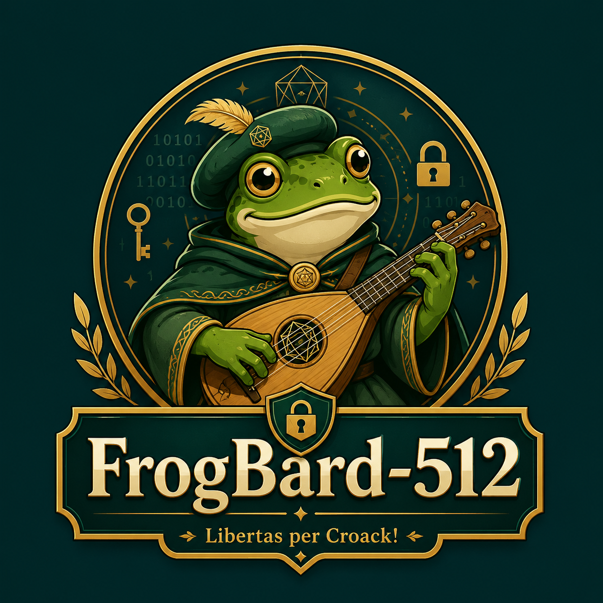

<p align="center">
  
</p>

<h1 align="center">FrogBard-512</h1>

<p align="center">
  <strong>A four-voice, 2048-bit permutation-based experimental hash written in low-level C11.</strong>
</p>

<p align="center">
  512-bit digest · 1024-bit rate · 1024-bit capacity · 16-round permutation · streaming API · tree hashing · AVX2
</p>

> [!CAUTION]
> **FrogBard-512 is an experimental research construction.**
> It is new, unpublished, and has not received independent cryptanalysis.
> Do not use it to protect production secrets, passwords, signatures, financial data, authentication protocols, or other security-critical systems.
> Use established algorithms such as SHA-512, SHA-3, BLAKE2, or BLAKE3 for production work.

## Overview

**FrogBard-512 v0.3-experimental** maps arbitrary finite byte strings to 512-bit digests.

The sequential mode is a sponge-like construction built around a custom 2048-bit permutation. The state is divided into four 512-bit **voices**, each containing eight 64-bit words:

- voices 0 and 1 form the 1024-bit rate;
- voices 2 and 3 form the 1024-bit capacity;
- each permutation call executes 16 rounds;
- finalization performs two additional full permutation calls;
- the final digest is the little-endian serialization of voice 0.

Each round combines:

1. public round constants;
2. one of four derived byte substitutions called **CroackBoxes**;
3. ARX quarter-rounds inside each voice;
4. a parity-dependent cross-voice braid;
5. fixed lane permutations.

The repository includes:

- a portable C11 implementation;
- a native AVX2 four-way backend;
- a separately domain-separated parallel tree mode;
- a constant-time bitsliced CroackBox profile;
- deterministic constant generation;
- fixed conformance vectors;
- reduced-round and inverse-permutation research tools;
- sanitizer, fuzzing, statistical, and stress-test infrastructure.

## Platform status

The sequential core is written in portable C11.

The current CLI and tree implementation target POSIX systems and use:

- POSIX threads;
- `pread()`;
- regular file descriptors;
- GNU Make-compatible build tooling.

Linux is the primary development platform.

## Repository layout

```text
.
├── assets/
│   └── logo.png
├── src/
│   ├── frogbard.c
│   ├── frogbard.h
│   ├── frogbard_aes_sbox.inc
│   ├── frogbard_avx2.c
│   ├── frogbard_cli.c
│   ├── frogbard_tables.h
│   ├── frogbard_tree.c
│   └── frogbard_tree.h
├── tools/
│   ├── frogbard_absurd_test.sh
│   ├── frogbard_analyze.c
│   ├── fuzz_frogbard.c
│   └── gen_tables.py
├── ANALYSIS.csv
├── ANALYSIS_NOTES.txt
├── CHANGELOG.md
├── Makefile
├── README.md
├── SPEC.md
├── TESTVECTORS.txt
├── THIRD_PARTY_NOTICES.md
└── TREEVECTORS.txt
```

Generated binaries, object files, fuzzing corpora, benchmark streams, and test reports should not be committed.

## Quick start

After cloning or downloading the repository:

```bash
cd frogbard-0.3-experimental
make
make test
```

Then hash a string:

```bash
./frogbard -s "Libertas per Croack!"
```

Check the compiled backend:

```bash
./frogbard --backend
```

Run the internal implementation tests:

```bash
./frogbard --self-test
```

## Dependencies

### Minimal Clang build on Ubuntu or Debian

```bash
sudo apt update
sudo apt install clang lld llvm make python3
```

### Minimal GCC build on Ubuntu or Debian

```bash
sudo apt update
sudo apt install build-essential make python3
```

### Optional research and validation tools

```bash
sudo apt install \
  valgrind cppcheck clang-tools clang-tidy \
  afl++ dieharder hyperfine lcov gcovr \
  binutils time jq bc
```

PractRand is optional and is used only by the extended statistical harness.

## Building with Clang and LLD

Clang with LLD is the default toolchain configured by the Makefile.

```bash
make clean
make -j"$(nproc)"
```

The native build uses approximately:

```text
clang -std=c11 -O3 -DNDEBUG
      -march=native -mtune=native -mavx2
      -flto=thin -ffunction-sections -fdata-sections
      -fuse-ld=lld -Wl,--gc-sections
```

The resulting executable is:

```text
./frogbard
```

Run the complete normal test target:

```bash
make test
```

Show the selected compiler and linker:

```bash
make info
```

## Building with GCC

The Makefile defaults to Clang-specific ThinLTO and LLD options. GCC therefore needs a few variable overrides.

Do not reuse object files produced by Clang. Always clean before changing compiler families.

### Native GCC build

```bash
make clean

make -j"$(nproc)" \
  CC=gcc \
  LTO=-flto \
  LLD=
```

Run the tests with the same overrides:

```bash
make \
  CC=gcc \
  LTO=-flto \
  LLD= \
  test
```

### Portable GCC build

This build does not require AVX2 and uses the scalar four-way fallback:

```bash
make clean

make \
  CC=gcc \
  LTO=-flto \
  LLD= \
  portable

./frogbard-portable --self-test
```

### GCC static library

```bash
make clean

make \
  CC=gcc \
  AR=gcc-ar \
  RANLIB=gcc-ranlib \
  LTO=-flto \
  LLD= \
  library
```

The output is:

```text
libfrogbard.a
```

### Manual GCC build without Make

Native AVX2 build:

```bash
gcc -Isrc \
  -std=c11 \
  -O3 -DNDEBUG \
  -march=native -mtune=native -mavx2 \
  -Wall -Wextra -Wpedantic -Wshadow \
  -Wconversion -Wsign-conversion \
  -Wformat=2 -Wundef \
  -Wstrict-prototypes -Wmissing-prototypes \
  -DFROGBARD_EXTERNAL_HASH4 \
  src/frogbard.c \
  src/frogbard_avx2.c \
  src/frogbard_tree.c \
  src/frogbard_cli.c \
  -pthread \
  -o frogbard-gcc
```

Portable scalar build:

```bash
gcc -Isrc \
  -std=c11 \
  -O3 -DNDEBUG \
  -Wall -Wextra -Wpedantic \
  src/frogbard.c \
  src/frogbard_tree.c \
  src/frogbard_cli.c \
  -pthread \
  -o frogbard-portable-gcc
```

Test either binary:

```bash
./frogbard-gcc --self-test
./frogbard-portable-gcc --self-test
```

## Makefile targets

### Main builds

```bash
make                    # native optimized Clang + LLD build
make portable           # portable scalar build
make strict             # warnings are errors
make debug              # -O0, debug symbols, frame pointers
make constant-time      # bitsliced scalar CroackBoxes + AVX2 four-way backend
make hardened           # PIE, RELRO, NOW, NX stack, stack protector, FORTIFY
make table              # copy native table build to frogbard-table
```

### Libraries

```bash
make library            # native libfrogbard.a
make portable-library   # portable scalar libfrogbard-portable.a
```

### Testing and diagnostics

```bash
make test               # self-test, CLI equivalence, tree determinism, inverse test
make ubsan              # build UndefinedBehaviorSanitizer binary
make test-sanitize      # build and execute UBSan self-test
make asan               # build AddressSanitizer binary
make fuzz-smoke         # 10,000 deterministic randomized inputs
make clang-analyze      # Clang Static Analyzer
```

### Research and generated artifacts

```bash
make analysis-tool      # build frogbard-analyze
make analyze            # reduced-round CSV measurements
make fuzz               # build Clang libFuzzer harness
make asm                # optimized Intel-syntax assembly
make regen-tables       # regenerate src/frogbard_tables.h
make package            # clean build and normal test suite
make clean              # remove generated binaries, objects, archives, and assembly
```

`make fuzz` and `make clang-analyze` require Clang. They are not GCC targets.

## Command-line interface

Display help:

```bash
./frogbard
```

Display the version:

```bash
./frogbard --version
```

### Hash a string

```bash
./frogbard -s "Libertas per Croack!"
```

### Hash a file with sequential streaming mode

```bash
./frogbard -f archive.tar
```

The sequential mode reads the file incrementally and does not load the complete file into memory.

### Hash standard input

```bash
printf abc | ./frogbard -f -
```

Another example:

```bash
cat archive.tar | ./frogbard -f -
```

### Hash a regular file with parallel tree mode

```bash
./frogbard -T archive.tar
```

Select a thread count:

```bash
./frogbard -T archive.tar -j 16
```

The long option is equivalent:

```bash
./frogbard --tree-file archive.tar -j 16
```

Tree mode accepts regular files. Standard input belongs to sequential mode.

### Inspect the active four-way backend

```bash
./frogbard --backend
```

Possible output:

```text
avx2-4way
```

or:

```text
portable-scalar
```

## Quick conformance check

Hash `abc`:

```bash
./frogbard -s abc
```

Expected FrogBard-512 v0.3 sequential digest:

```text
d73421ee1419c7ba0a5da91d9e728c5b4383e26337dec3c377ca53f656b556b11bc924b8677163e88187a31481f553e2c1c4abc48fe213ce11a1208d71474113
```

Check string, file, and stdin equivalence:

```bash
printf abc > /tmp/frogbard-abc.txt

./frogbard -s abc
./frogbard -f /tmp/frogbard-abc.txt
printf abc | ./frogbard -f -
```

All three sequential digests must match.

Tree mode intentionally produces a different digest:

```bash
./frogbard -T /tmp/frogbard-abc.txt
```

## C API

Include the public header:

```c
#include "frogbard.h"
```

### One-shot hashing

```c
#include "frogbard.h"

#include <stdint.h>
#include <stdio.h>
#include <string.h>

int main(void)
{
    static const char message[] = "Libertas per Croack!";
    uint8_t digest[FROGBARD_DIGEST_BYTES];

    frogbard_hash(message, strlen(message), digest);

    for (size_t i = 0; i < sizeof(digest); ++i) {
        printf("%02x", digest[i]);
    }
    putchar('\n');

    return 0;
}
```

Compile against the portable static library:

```bash
make portable-library

gcc -Isrc example.c \
  libfrogbard-portable.a \
  -o example
```

### Streaming API

```c
frogbard_ctx ctx;
uint8_t digest[FROGBARD_DIGEST_BYTES];

frogbard_init(&ctx);
frogbard_update(&ctx, first_part, first_part_length);
frogbard_update(&ctx, second_part, second_part_length);
frogbard_final(&ctx, digest);
```

The main sequential API is:

```c
void frogbard_init(frogbard_ctx *ctx);

void frogbard_update(
    frogbard_ctx *ctx,
    const void *data,
    size_t len
);

void frogbard_final(
    frogbard_ctx *ctx,
    uint8_t out[FROGBARD_DIGEST_BYTES]
);

void frogbard_hash(
    const void *data,
    size_t len,
    uint8_t out[FROGBARD_DIGEST_BYTES]
);
```

### Four-message API

```c
void frogbard_hash4_equal(
    const void *data0,
    const void *data1,
    const void *data2,
    const void *data3,
    size_t len,
    uint8_t out[4][FROGBARD_DIGEST_BYTES]
);
```

All four inputs must have the same length.

A native AVX2 build processes the four independent states in parallel. Portable builds transparently execute four scalar hashes.

## Construction summary

| Parameter | Value |
|---|---:|
| Digest size | 512 bits |
| Internal state | 2048 bits |
| State layout | 4 voices × 8 words × 64 bits |
| Rate | 1024 bits |
| Capacity | 1024 bits |
| Sequential block size | 128 bytes |
| Main permutation | 16 rounds |
| Finalization | 2 additional full permutations |
| Tree leaf payload | 1 MiB |
| External byte order | Little endian |
| Sequential core allocation | No dynamic allocation |

### Round structure

A full round performs:

```text
round constants
    ↓
voice-dependent CroackBoxes
    ↓
within-voice ARX mixing
    ↓
cross-voice braid
    ↓
lane permutation
```

The permutation itself has no data-dependent branches.

The default table profile performs message-dependent accesses to a 1 KiB S-box working set. The constant-time profile replaces those scalar table lookups with a bitsliced Boolean circuit.

## Four derived CroackBoxes

The public derivation phrases are:

1. `Libertas per Croack!`
2. `Presunto`
3. `Floquinha`
4. `In Frog we Trust!`

The phrases are public constants. They are not passwords, keys, salts, or secret material.

Each CroackBox is affine-equivalent to the AES S-box. The deterministic generator selects:

- an input bit permutation;
- an output bit permutation;
- an input XOR constant;
- an output XOR constant.

Candidates containing fixed points or opposite-fixed points are rejected.

The generator produces:

- four forward CroackBoxes;
- four inverse CroackBoxes;
- affine metadata for the bitsliced implementation;
- 512 round-constant words;
- the 2048-bit initial state.

Regenerate the tables:

```bash
make regen-tables
```

Verify that regeneration did not alter committed values:

```bash
sha256sum src/frogbard_tables.h
git diff -- src/frogbard_tables.h
```

## AVX2 four-way backend

The native backend processes four independent equal-length messages.

Each 256-bit SIMD vector contains one corresponding 64-bit state word from each of four hashes. The vector lanes are independent messages, not four pieces of one FrogBard state.

This approach preserves the scalar algorithm while accelerating workloads that naturally contain multiple equal-length inputs, especially:

- tree leaves;
- tree parent nodes;
- batch hashing;
- test-vector generation.

The AVX2 source is compiled separately from the scalar core. The scalar core is built with `FROGBARD_EXTERNAL_HASH4` when the external SIMD implementation is linked.

## Parallel tree mode

Tree mode is a separate, explicitly domain-separated construction.

It uses:

- 1 MiB leaf payloads;
- indexed leaf encodings;
- explicit child counts in parent encodings;
- zero-filled right children for unary parents;
- final root binding.

The final root binds:

- total file size;
- leaf chunk size;
- leaf count;
- tree height;
- internal root digest.

Worker threads claim groups of up to four leaves and read data using `pread()`. Complete four-leaf groups use the AVX2 backend in native builds.

Because its encoding and domain are different:

```text
tree_digest(file) != sequential_digest(file)
```

This is intentional.

## Constant-time profile

Build:

```bash
make constant-time
```

Output:

```text
./frogbard-ct
```

Compare it with the default table build:

```bash
./frogbard -s "Presunto"
./frogbard-ct -s "Presunto"
```

The digests must be identical.

The constant-time profile removes data-dependent scalar S-box table addresses by using:

- an orthogonal bitslice transformation;
- a Boolean AES S-box circuit;
- the derived affine transformations for each CroackBox.

This profile does not turn FrogBard into a keyed primitive and does not establish production security. It only changes the implementation strategy for the same hash function.

## Research and analysis tools

Build the analysis utility:

```bash
make analysis-tool
```

### Reduced-round measurements

```bash
./frogbard-analyze --all 512
```

The CSV output contains measurements for rounds 1 through 16:

- average state avalanche;
- minimum state avalanche;
- maximum state avalanche;
- rotational-relation distance;
- sampled absolute linear bias.

### Exact inverse test

```bash
./frogbard-analyze --inverse 128
```

This verifies:

```text
P_r^-1(P_r(x)) = x
```

for sampled states and every reduced round count.

### Sampled linear scan

```bash
./frogbard-analyze --linear-scan 4 8192 128
```

### Sampled differential bit-bias scan

```bash
./frogbard-analyze --differential-scan 4 4096 64
```

### Simple invariant smoke tests

```bash
./frogbard-analyze --invariants 4
```

### Truncated collision smoke test

```bash
./frogbard-analyze --collision 4 24 200000
```

A collision in a deliberately truncated output is expected from the birthday bound. It is not evidence of a collision in the complete 512-bit digest.

These utilities are exploratory instruments, not security proofs.

## Extended validation harness

The repository includes a large research harness:

```bash
chmod +x tools/frogbard_absurd_test.sh
```

Quick profile:

```bash
./tools/frogbard_absurd_test.sh --quick --install
```

Full profile:

```bash
./tools/frogbard_absurd_test.sh --full --install --jobs 16
```

Very large multi-hour profile:

```bash
./tools/frogbard_absurd_test.sh --insane --install --jobs 32
```

> [!WARNING]
> The `--insane` profile can run for several hours and create many gigabytes of temporary streams, benchmark files, coverage data, fuzzing corpora, and logs.

The harness covers categories such as:

- compiler and optimization diversity;
- fixed vectors and streaming equivalence;
- padding boundaries;
- scalar, bitsliced, and AVX2 equivalence;
- tree determinism across thread counts;
- sanitizer execution;
- Valgrind Memcheck, Helgrind, and DRD;
- libFuzzer and AFL++;
- one-shot versus incremental randomized API testing;
- PractRand and Dieharder streams;
- reduced-round analysis;
- resource limits;
- benchmark collection;
- binary hardening inspection.

## Local empirical validation snapshot

A multi-hour local development run included:

- 1,000,000 randomized API cases;
- approximately 1.48 million libFuzzer executions with no crash;
- one hour of AFL++ with no crash or timeout;
- 8 GiB of counter-derived output tested by PractRand;
- 8 GiB of one-bit-differential output tested by PractRand;
- no PractRand anomaly in 270 reported tests for either stream;
- no Dieharder `FAILED` result;
- sanitizer and Valgrind-family checks without a reported implementation defect;
- digest avalanche mean close to 256 changed bits out of 512;
- 16-round state avalanche close to 1024 changed bits out of 2048.

These are implementation and statistical observations from one development environment. They are not independent cryptanalysis and do not establish collision, preimage, second-preimage, indifferentiability, or structural security.

## Test coverage

The internal self-test checks:

- CroackBox bijectivity;
- differential uniformity 4;
- absence of fixed points;
- absence of opposite-fixed points;
- inverse CroackBox correctness;
- table/bitslice equivalence for all 256 byte values in all four boxes;
- fixed empty-string and `abc` vectors;
- one-shot and streaming equivalence;
- multiple message lengths and update segmentations;
- exact permutation inversion for rounds 1 through 16;
- scalar and four-way backend equivalence.

`make test` additionally checks:

- string versus file hashing;
- tree determinism across thread counts;
- tree behavior around leaf boundaries;
- tree-root sensitivity to a one-byte modification;
- sampled inverse-permutation testing through `frogbard-analyze`.

Passing these tests shows that implementations agree with the current specification and catches many programming errors. It does not prove cryptographic security.

## Performance snapshot

Local measurements for a 64 MiB zero-filled file:

```text
v0.2 sequential table path:      ~1.40 s
v0.3 sequential table path:      ~1.17 s
v0.3 scalar bitsliced path:      ~2.15 s
v0.3 tree, 8 threads + AVX2:     ~0.11 s
```

These values are not portable guarantees.

Performance depends on:

- CPU microarchitecture;
- compiler and compiler version;
- optimization flags;
- AVX2 availability;
- thread count;
- storage and page cache state;
- operating system;
- virtualization;
- thermal and power limits.

Sequential and tree results are different hash domains and should not be compared as interchangeable algorithms.

## Generated and ignored files

A suitable `.gitignore` should include at least:

```gitignore
# Build outputs
frogbard
frogbard-*
*.o
*.a
*.s

# Test reports and large generated streams
frogbard-test-report-*/
bench/
stats/*.bin
coverage/
fuzz/
afl/

# Compiler coverage
*.profraw
*.profdata
*.gcda
*.gcno

# Temporary files
*.tmp
*.log
```

Do not ignore committed source files whose names begin with `frogbard-`; refine the executable patterns if your repository contains similarly named release archives.

## Design limitations

FrogBard-512 v0.3 currently has no:

- independent cryptanalysis;
- formal wide-trail active-S-box bound;
- formal differential or linear probability bound for the complete permutation;
- published security reduction;
- standardized algorithm identifier;
- frozen interoperability profile;
- production deployment recommendation.

Important structural research remains, including:

- automated differential and linear trail search;
- MILP, SAT, SMT, and CP modeling;
- rotational and carry-dependent ARX analysis;
- invariant-subspace and symmetry analysis;
- rebound, boomerang, integral, and impossible-differential attacks;
- meet-in-the-middle and splice-and-cut analysis;
- algebraic degree growth;
- reduced-round collision, preimage, and distinguisher attacks;
- tree-encoding and multicollision analysis.

## What FrogBard-512 is not

FrogBard-512 is not currently intended to be used as:

- a password hash;
- a password-based KDF;
- a MAC;
- a digital signature;
- an authenticated-encryption primitive;
- a random-number generator;
- a proof-of-work scheme;
- a drop-in replacement for standardized production hashes.

## Documentation

The repository documentation includes:

- `SPEC.md` — construction and encoding details;
- `TESTVECTORS.txt` — sequential conformance vectors;
- `TREEVECTORS.txt` — tree-mode vectors;
- `ANALYSIS.csv` — reduced-round measurements;
- `ANALYSIS_NOTES.txt` — analysis notes;
- `CHANGELOG.md` — version history;
- `THIRD_PARTY_NOTICES.md` — third-party attributions.

The mathematical and empirical validation paper may also be stored in the repository root:

```text
FrogBard-512-v0.3-Empirical-Validation-Revision.pdf
```

## Third-party notice

The bitsliced AES S-box circuit is adapted from work associated with the Boyar-Peralta circuit and software distributed through BearSSL/PQClean lineage.

See:

```text
THIRD_PARTY_NOTICES.md
```

for the complete attribution and applicable license notice.

## License

FrogBard-512 is distributed under the MIT License.

Copyright © 2026 Víctor Duarte Melo.

---

<p align="center">
  <strong>Libertas per Croack!</strong>
</p>
